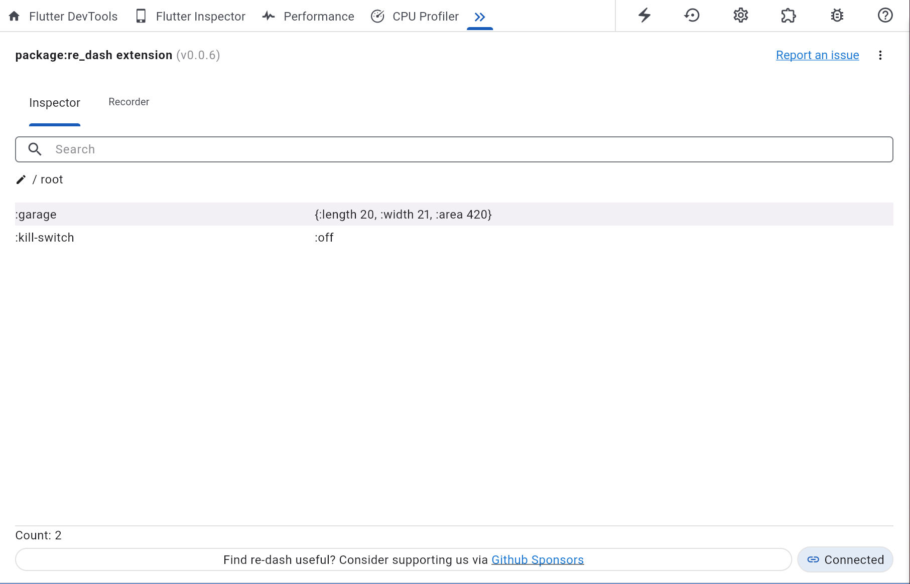
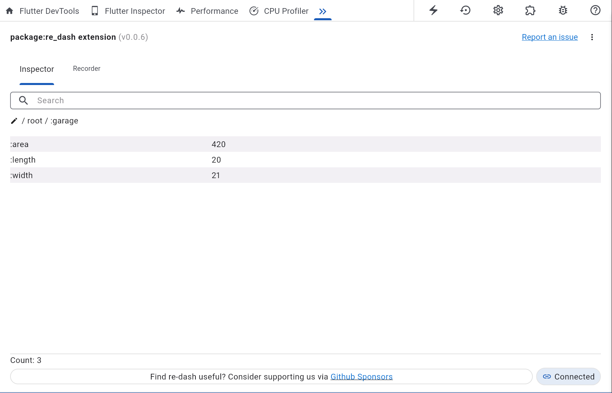
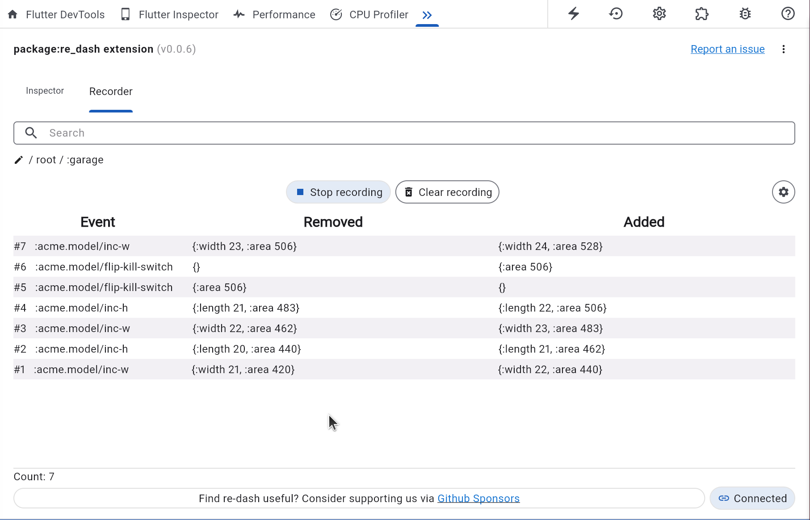
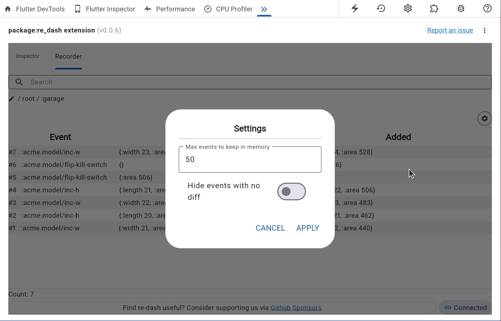

# re-dash-inspector

A Flutter DevTools extension for [re-dash](https://github.com/htihospitality/re-dash)

# Features

## Inspector

- Visualize the contents of the re-dash app database ([AppDB](https://github.com/htihospitality/re-dash/blob/main/doc/04-databases.md#appdb)) during development
- Free text search anything
- Drill down into nested data structures (maps & lists)

## Recorder

- Start & stop a recording of all events
- See a diff of the database changes effected by each event
- Free text search anything
- Use the Path editor to zone in to only the parts of interest in the database


> _This extension only supports the [AppDB](https://github.com/htihospitality/re-dash/blob/main/doc/04-databases.md#appdb) database backend for re-dash. When using another database backend (eg. [Drift](https://github.com/htihospitality/re-dash/blob/main/doc/04-databases.md#drift)) it will typically ship with their own DevTools extenstion eg. the [drift_db_viewer](https://drift.simonbinder.eu/docs/community_tools/#drift_db_viewer)_

# Screenshots

## Inspector




## Recorder




# Demo

[re-dash-inspector.webm](https://github.com/user-attachments/assets/e6864f98-e97f-4d9a-8624-ac06c71c9cef)

# Prerequisites

- [re-dash](https://github.com/htihospitality/re-dash) v1.1.0 minimum
- The contents of the app db need to be serializable to/from EDN using ClojureDart's `pr-str` and `cljd.reader/read-string`

# Usage

Add `re_dash_inspector` to your `dev_dependencies` in `pubspec.yaml`

```yaml
dev_dependencies:
  re_dash_inspector: ^0.0.6
```

then register the `debug` re-dash interceptor targeting dev-tools either in selected event handlers or globally in `main` like

```clojure
(rd/reg-global-interceptor
    (rd/debug {:target :target/dev-tools}))
```

See [Debugging](https://github.com/htihospitality/re-dash/blob/main/doc/02-debugging.md) for more options using the `debug` interceptor.

# Performance

## App

The DevTools extension is updated with a new copy of the app-db contents every time a `:db` effect mutates the database. This is done via serializing the entire app-db using `pr-str` before sending it to DevTools where it will be deserialized using `cljd.reader/read-string` before being rendered on screen.

Keep this in mind while developing, as it might add some overhead to your application during each re-dash event loop. Importantly this will not impact your compiled application at all, only during development mode - if even noticeable at all.

## Extension

When the Recorder is started, the app-db contents will be diff'ed using ClojureDart's `clojure.data/diff` implementation. This work is done in the DevTools extension process, not the app's process, so the app will not incur this performance overhead, but the DevTools process will. This work is offloaded onto 4 [Web Workers](https://developer.mozilla.org/en-US/docs/Web/API/Web_Workers_API/Using_web_workers) running in the background, but depending on the size of the app-db being diff'ed, you might notice some UI performance degradation in this re-dash-inspector as the results of these diff's are being rendered on screen.
